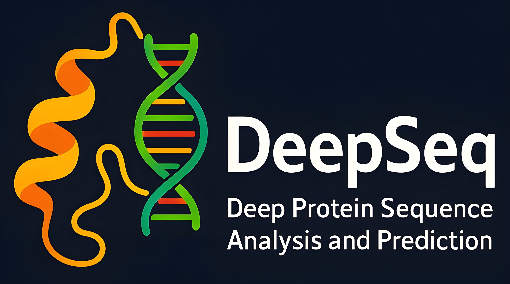

# DeepSeq - Deep Protein Analysis and Prediction

DeepSeq is a comprehensive protein analysis tool built on the ESM-2 language model, offering structure prediction, sequence embeddings analysis, residue property visualization, stability assessment, and function prediction capabilities.

## Overview
DeepSeq leverages state-of-the-art protein language models to provide researchers and bioinformaticians with detailed insights into protein sequences. The tool combines structure prediction, embedding analysis, and property visualization in an intuitive interface, making advanced protein analysis accessible to all users. By integrating multiple analysis modalities, DeepSeq offers a comprehensive platform for understanding protein structure, function, and behavior under various conditions.

## Features
- **3D Structure Prediction**: Accurate protein structure prediction using ESMFold with confidence metrics (plDDT)
- **Sequence Embeddings Analysis**: Visualization of high-dimensional protein embeddings using PCA and t-SNE
- **Residue Property Analysis**: Detailed per-residue property visualization including hydrophobicity, charge, and secondary structure propensity
- **Stability Assessment**: Prediction of protein stability under various temperature, pH, and salt conditions
- **Function Prediction**: Analysis of potential functions, subcellular localization, antimicrobial potential, and toxicity
- **Interactive Visualization**: User-friendly interface with customizable display options and downloadable results
- **Batch Processing**: Support for analyzing multiple protein sequences in succession
- **Export Capabilities**: Download structures, plots, and analysis reports in various formats
